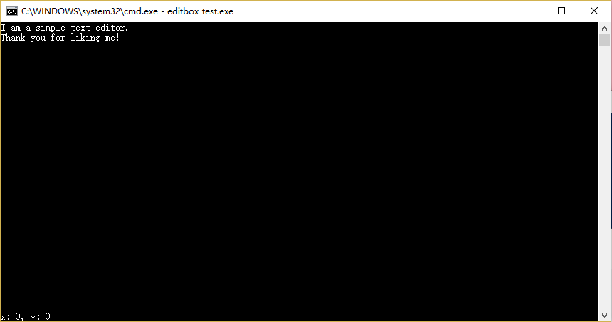

# Edit Box

A simple text editor with command. (支持中文)

## Requirements

Edit Box requires the following to run:

* ANSI C

* Windows

## Keys

* Ctrl + S: Save
* Arrow Key
* Enter
* Backspace

## Demo

* open cmd or powershell
* cd your path and run the following

```powershell
git clone git://github.com/Freder-chen/edit_box.git EditBox
cd ./EditBox/Code
make all
./editbox_test
```



## Usage

You only need to include "editbox.h" to call it.

``` c
editbox(filename);
```

## Fun

* [My Blog](https://freder-chen.github.io/2018/03/10/%E5%A6%82%E4%BD%95%E7%94%A8C%E8%AF%AD%E8%A8%80%E5%86%99%E4%B8%80%E4%B8%AA%E5%A4%9A%E8%A1%8C%E8%BE%93%E5%85%A5%E5%87%BD%E6%95%B0/)
* [Kilo](https://github.com/antirez/kilo)

